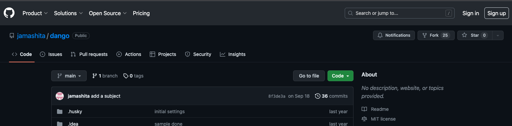
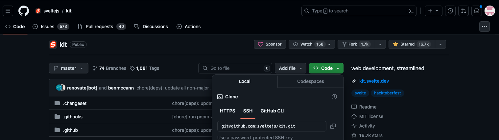

# TypeScriptで開発しよう

## 概要

プログラミングを楽しもう。フロントエンドでもバックエンドでもひとつの言語で開発ができるTypeScriptで簡単にwebアプリケーションをつくってみよう。

## 対象

プログラミング初学者(他のプログラミング言語の経験者でなくても可)

## 開催頻度

月1回を予定。初めは各々の開発環境ができているかを相談しながら構築。それ以降は漠然と与えた課題をもとに、もくもく開発する会とします。

その間は各自で取り組んでいただきますが、質問は適宜してもらって問題ありません。

### わからなくなったとき

わからなくなったときは、Discordで連絡してください

## 準備（必要なもの）

- [GitHub](https://github.com/)のアカウント(無料で十分)
- IDE（Integrated Development Environment:統合開発環境）のインストール
    - [VSCode](https://code.visualstudio.com/)がおすすめ
- [Discord](https://discord.com/)
    - 勉強会の通話、画面共有の道具として使います。これがないと参加できません
    - やました: `jamashita` にともだち申請のDMを送ってください

## 第1回で準備するもの

Node.jsとpnpmのバージョンは、このリポジトリの`mise.toml`というファイルで指定されています。バージョン管理ツール[mise](https://mise.jdx.dev/)をインストールしておけば、リポジトリを取得したあとに`mise install`と打つだけで指定されたバージョンのNode.js・pnpmが自動的にインストールされます。ここでは、そのmiseのインストールまで行います。

### Windowsのひと

**WindowsのひとはPowerShellを使います**

- [Git](https://gitforwindows.org/)
    インストーラーがある
- mise
    PowerShellで以下を実行する（Windows 11や最近のWindows 10には`winget`が最初から入っているはずです）
    ```
    winget install jdx.mise
    ```
    `winget`が`認識されません`と言われた場合は、Microsoft Storeで[App Installer](https://apps.microsoft.com/detail/9nblggh4nns1)をインストールしてからもう一度試してください。それでも難しい場合は代わりに[Scoop](https://scoop.sh/)を使う方法もあります(詳しくは[docs/migration.md](migration.md)を参照)。

    インストールできたら、PowerShellのプロファイルに以下を追加してPowerShellを再起動する
    ```
    echo '(&mise activate pwsh) | Out-String | Invoke-Expression' >> $HOME\Documents\PowerShell\Microsoft.PowerShell_profile.ps1
    ```
1. 以下が`command not found`とならなければおわり
    `mise --version`

### Macのひと

Homebrewをインストールする
<https://brew.sh/ja/>
その後これを実施する

```bash=
echo 'eval "$(/opt/homebrew/bin/brew shellenv)"' >> /Users/自分のユーザー名/.zshrc
```

以下を順番に1行ずつTerminalで実施する

```bash=
brew install mise
echo 'eval "$(mise activate zsh)"' >> ~/.zshrc
source ~/.zshrc
```

以下が`command not found`とならなければおわり

```
mise --version
```

### 以下共通

#### 用語定義

##### `~`

ホームディレクトリのこと

##### 鍵

公開鍵と秘密鍵のこと。今回のインストールでは`id_rsa`と`id_rsa.pub`がそれにあたる。`.pub`のほうが公開鍵。

#### 鍵を作成する

1. PowerShell, Terminalで以下を実行する
    ```
    ssh-keygen -t rsa
    ```
    - 英語で質問がくるのでEnter連打でよい。途中**作られるふたつのファイルをどこに保存するか**聞かれるので、その場所を覚えておく
    - 作られたファイルが`id_rsa`, `id_rsa.pub`という名前（のはず）なので、そのうち`.pub`のほうを開き、内容をコピーする
    - GitHubの右上、自分のアイコンをクリックしでてくるメニューの中で下のほうにある**Settings**をクリック
    - 左ペインにある**SSH and GPG keys**をクリック
    - 緑色のボタン**New SSH key**をクリック
        - Titleは自分がわかればなんでもよい。おすすめは登録するマシンの名前とか
        - Key typeはそのままでよい
        - Keyに先ほどコピーした内容を貼り付ける
        - `Add SSH key`をクリックして保存する
1. PowerShell, Terminalで以下を実行する (1行ずつ実施)
    `~/.ssh/config`を作成する
    ```
    cd ~
    mkdir .ssh (失敗する可能性あり: 失敗の場合は無視してください)
    chmod 700 .ssh (windowsの人は不要)
    cd .ssh
    touch config (windowsのひとは New-item config)
    chmod 700 config　(windowsの人は不要)
    ```
    ここまでで`~/.ssh/config`というファイルができているので、その`config`というファイルを開き、以下をテキストエディタで書き込み保存する
    
    ```
    Host github.com
        HostName github.com
        User git
        IdentityFile ~/.ssh/id_rsa
   ```

これで鍵の作成は完了です

#### サンプルを取得する

やましたが作ったサンプル<https://github.com/jamashita/dango>を自分のGitHubのアカウントへコピーします。

1. `~/.gitconfig`というファイルを作成します
    ```
    cd ~
    touch .gitconfig (windowsのひとは New-item .gitconfig)
    ```
    gitのユーザー名、メールアドレスを書き込む。なお偽名、偽メールアドレスでも問題ない。以下は例
    ```
    [user]
        name = jamashita
        email = jamashita@jamashita.com
    ```
1. <https://github.com/jamashita/dango>へアクセスする
2. 画面上部、右側にある`Fork`をクリック
    なんだかんだでるので読んでください
    
    この画像だと右上に Notifications, Fork, Start とあるところの真ん中のForkです。

1. `jamashita/dango`と表示されていたものが`自分の名前/dango`となるはず
2. 画面上部の緑色のボタンをクリック
5. HTTPS, SSH, GitHub CLIと選べるのでSSHを選ぶ
    
    この画像はdangoではないけど、緑色のボタンは画像まんなかちょっと右の Codeのことです。
7. 下に表示される`git@github.com:~~~~~/dango.git`をコピーする
    紙が2枚重なっているようなアイコンをクリックしてもコピーできます。
5. PowerShell, Terminalで以下を実行する
    ```
    git clone git@github.com:~~~~~/dango.git (先ほどコピーしたURL)
    ```


これでご自分のコンピューターにdangoを持ってくることができました

#### GitHubに自分の書いた内容を適用（Pushという)できるか検証する

1. VSCodeを起動する
2. File > Open Folderで先ほど持ってきたdangoのディレクトリを指定する
1. ためしに`README.md`に何か書いてみる（みられたら困る内容を書かないでください）
2. VSCodeの画面左、上から3番目のふたまたニョキニョキのアイコンをクリックする
    
    画面でいうと上から、2枚の紙が重なったアイコン、虫眼鏡のアイコンの下
4. Changesの中にファイル`README.md`があるのでそれにマウスカーソルを載せると`+`が表示されるので押す。押すと`README.md`が`Staged Changes`に変わる
    
6. この状態でその上にあるMessageと書いてあるテキストボックスに適当に何か書き込み、`Commit`という青色のボタンを押す
7. `Commit`を押すと青色のボタンがリサイクルっぽくなる場合はそれを押す、そうでない場合はそれより上の三点リーダ`...`をクリックし`Push`を押す
8. GitHubの自分のdangoのトップページを見に行くと、書いた内容が反映されているはず

#### サンプルを動かす

1. VSCodeを起動する
2. File > Open Folderで先ほど持ってきたdangoのディレクトリを指定する
3. View > TerminalでTerminalを表示させる
4. Terminalで`mise trust`を実行する(初回だけ、このリポジトリの`mise.toml`を信頼するか聞かれます)
5. `mise install`を実行する(Node.jsとpnpmが自動的にインストールされます)
6. `node -v`と`pnpm -v`を実行し、`command not found`にならないことを確認する
7. `pnpm install`を実行する
8. `pnpm dev`を実行する
9. ブラウザで<http://localhost:3000>にアクセスするとサンプルが表示される


(注意) `pnpm dev`は自動的に終了しないので、自分で終了する必要があります。そのときはTerminalにフォーカスを合わせてCtrl + cする必要があります

## 開発する上で参考になる書籍

- [サバイバルTypeScript](https://typescriptbook.jp/)
拙著(おてつだいレベル)