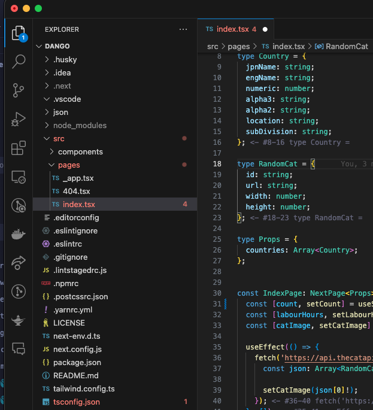
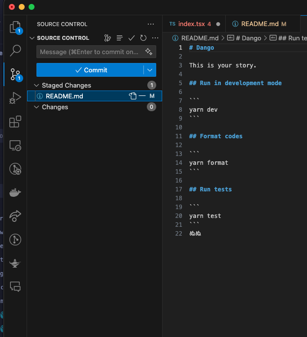

# TypeScriptで開発しよう

## 概要

プログラミングを楽しもう。フロントエンドでもバックエンドでもひとつの言語で開発ができるTypeScriptで簡単にwebアプリケーションをつくってみよう。

## 対象

プログラミング初学者(他のプログラミング言語の経験者でなくても可)

## 開催頻度

月1回を予定。初めは各々の開発環境ができているかを相談しながら構築。それ以降は漠然と与えた課題をもとに、もくもく開発する会とします。

その間は各自で取り組んでいただきますが、質問は適宜してもらって問題ありません。

### わからなくなったとき

わからなくなったときは、Discordで連絡してください

## 準備（必要なもの）

- [GitHub](https://github.com/)のアカウント(無料で十分)
- IDE（Integrated Development Environment:統合開発環境）のインストール
    - [VSCode](https://code.visualstudio.com/)がおすすめ
- [Discord](https://discord.com/)
    - 勉強会の通話、画面共有の道具として使います。これがないと参加できません
    - やました: `jamashita` にともだち申請のDMを送ってください

## 第1回で準備するもの

Node.jsとpnpmのバージョンは、このリポジトリの`mise.toml`というファイルで指定されています。バージョン管理ツール[mise](https://mise.jdx.dev/)をインストールしておけば、リポジトリを取得したあとに`mise install`と打つだけで指定されたバージョンのNode.js・pnpmが自動的にインストールされます。

また、GitHubの操作は公式CLIツール[GitHub CLI(`gh`)](https://cli.github.com/)を使うと、鍵の作成やFork・Cloneが自動化できて楽になります。`gh`もmiseで入れられるので、ここではmise本体のインストールと、miseを使った`gh`のインストールまで行います。

### Windowsのひと

**WindowsのひとはPowerShellを使います**

- [Git](https://gitforwindows.org/)
    インストーラーがある
- mise
    PowerShellで以下を実行する（Windows 11や最近のWindows 10には`winget`が最初から入っているはずです）
    ```
    winget install jdx.mise
    ```
    `winget`が`認識されません`と言われた場合は、Microsoft Storeで[App Installer](https://apps.microsoft.com/detail/9nblggh4nns1)をインストールしてからもう一度試してください。それでも難しい場合は代わりに[Scoop](https://scoop.sh/)を使う方法もあります(詳しくは[docs/migration.md](migration.md)を参照)。

    インストールできたら、miseが管理するnode/pnpm/ghなどのコマンドにPATHを通します。
    1. PowerShellで以下を実行し、出力される `dirs:` の `shims:` に表示されたパスをメモする
        ```powershell
        mise doctor
        ```
        例: `C:\Users\ユーザー名\AppData\Local\mise\shims`
    2. スタートメニューで「環境変数」と検索し、「環境変数を編集」（アカウントの環境変数を編集する）を開く
    3. 「〇〇のユーザー環境変数」の一覧から `Path` を選んで「編集」をクリック
    4. 「新規」をクリックし、1でメモしたパスを追加する
    5. 「OK」を押してすべて閉じ、開いているPowerShell・VS Codeをすべて完全に閉じてから開き直す
1. GitHub CLI(`gh`)をmiseでインストールする
    PowerShellで以下を実行する
    ```
    mise use --global gh
    ```
1. 以下がすべて`command not found`とならなければおわり
    `mise --version`
    `gh --version`

### Macのひと

Homebrewをインストールする
<https://brew.sh/ja/>
その後これを実施する

```bash=
echo 'eval "$(/opt/homebrew/bin/brew shellenv)"' >> /Users/自分のユーザー名/.zshrc
```

以下を順番に1行ずつTerminalで実施する

```bash=
brew install mise
echo 'eval "$(mise activate zsh)"' >> ~/.zshrc
source ~/.zshrc
mise use --global gh
```

以下がすべて`command not found`とならなければおわり

```
mise --version
gh --version
```

### 以下共通

#### 用語定義

##### `~`

ホームディレクトリのこと

##### 鍵

公開鍵と秘密鍵のこと。GitHubに安全にログインするために使う。今回は`gh`コマンドが自動で作ってくれるので、自分でこの2つのファイルを作る必要はない。

#### GitHubにログインする

1. PowerShell, Terminalで以下を実行する
    ```
    gh auth login
    ```
1. いくつか質問されるので、以下のように答える(矢印キーで選択してEnter)
    - `What account do you want to log into?` → `GitHub.com`
    - `What is your preferred protocol for Git operations on this host?` → `SSH`
    - `Generate a new SSH key to add to your GitHub account?` → `Yes`
    - パスフレーズを聞かれたら、何も入力せずEnterでよい(空でよい)
    - `Title for your SSH key` → そのままEnter(自動で名前がつく)
    - `Upload your SSH public key to your GitHub account?` → 矢印キーで`Skip`ではなく、上に表示されている鍵のタイトル（さっき決まった名前）の方を選んでEnter。`Skip`を選ぶと鍵がGitHubに登録されず、この後のログインに失敗します
    - `How would you like to authenticate GitHub CLI?` → `Login with a web browser`
1. `First copy your one-time code: XXXX-XXXX`と表示されるので、そのコードを覚えておく
1. Enterを押すとブラウザが開くので、GitHubにログインし、先ほどのコードを入力する
1. ブラウザで許可すると、Terminal側に`✓ Logged in as ...`と表示されて完了

これで鍵の作成・GitHubへのログインは完了です（鍵は`gh`が裏側で自動的に作ってGitHubに登録してくれています）。

#### サンプルを取得する

やましたが作ったサンプル<https://github.com/jamashita/dango>を自分のGitHubのアカウントへコピーします。

1. まずgitに自分の名前・メールアドレスを教えます。PowerShell, Terminalで以下を実行する（偽名、偽メールアドレスでも問題ありません）
    ```
    git config --global user.name "自分の好きな名前"
    git config --global user.email "自分の好きなメールアドレス"
    ```
1. PowerShell, Terminalで以下を実行する
    ```
    gh repo fork jamashita/dango --clone
    ```
    - `Would you like to fork this repository?` のように聞かれたら`Y`(Yes)と答える
    - しばらく待つとFork（自分のアカウントへのコピー）と、自分のコンピューターへのCloneが両方終わります

これでご自分のコンピューターにdangoを持ってくることができました

#### GitHubに自分の書いた内容を適用（Pushという)できるか検証する

1. VSCodeを起動する
2. File > Open Folderで先ほど持ってきたdangoのディレクトリを指定する
1. ためしに`README.md`に何か書いてみる（みられたら困る内容を書かないでください）
2. VSCodeの画面左、上から3番目のふたまたニョキニョキのアイコンをクリックする
    
    画面でいうと上から、2枚の紙が重なったアイコン、虫眼鏡のアイコンの下
4. Changesの中にファイル`README.md`があるのでそれにマウスカーソルを載せると`+`が表示されるので押す。押すと`README.md`が`Staged Changes`に変わる
    
6. この状態でその上にあるMessageと書いてあるテキストボックスに適当に何か書き込み、`Commit`という青色のボタンを押す
7. `Commit`を押すと青色のボタンがリサイクルっぽくなる場合はそれを押す、そうでない場合はそれより上の三点リーダ`...`をクリックし`Push`を押す
8. GitHubの自分のdangoのトップページを見に行くと、書いた内容が反映されているはず

#### サンプルを動かす

1. VSCodeを起動する
2. File > Open Folderで先ほど持ってきたdangoのディレクトリを指定する
3. View > TerminalでTerminalを表示させる
4. Terminalで`mise trust`を実行する(初回だけ、このリポジトリの`mise.toml`を信頼するか聞かれます)
5. `mise install`を実行する(Node.jsとpnpmが自動的にインストールされます)
6. `node -v`と`pnpm -v`を実行し、`command not found`（Windowsでは`not recognized`）にならないことを確認する。うまくいかない場合は下の「うまくいかないときは」を見てください
7. `pnpm install`を実行する
8. `pnpm dev`を実行する
9. ブラウザで<http://localhost:3000>にアクセスするとサンプルが表示される


(注意) `pnpm dev`は自動的に終了しないので、自分で終了する必要があります。そのときはTerminalにフォーカスを合わせてCtrl + cする必要があります

## うまくいかないときは

- `mise install`は終わっているはずなのに`node -v` / `pnpm -v`が`command not found`（Windowsでは`not recognized`）になる → インストール自体はできていて、PATHがまだ反映されていないだけのことが多いです。
    - PATHを設定した（Windowsの上記手順、またはmacOSの`mise activate`）後、ターミナル（VS Codeの統合ターミナルも含む）を一度も開き直していない → すべて閉じてから開き直す
    - それでも直らない場合は`mise doctor`を実行してエラーを確認してください。`shims_on_path: no`になっている場合は、上のWindowsセットアップ手順（`mise doctor`でshimsのパスを確認し、環境変数に追加する）をやり直してください
- 以前 [Volta](https://volta.sh/) で Node をインストールしたことがある → Voltaが干渉している可能性があります。以下の手順で確認・アンインストールしてください。
    1. 入っているか確認する
        ```
        volta --version
        ```
        コマンドが見つからなければVoltaは入っていないので、この項目は無視してOKです。
    2. アンインストールする

        **macOS / Linux**
        ```
        rm -rf ~/.volta
        ```
        続けて `~/.zshrc`（`bash`の場合は `~/.bashrc` や `~/.bash_profile`）を開き、以下のような行が残っていれば削除してください。
        ```
        export VOLTA_HOME="$HOME/.volta"
        export PATH="$VOLTA_HOME/bin:$PATH"
        ```

        **Windows**

        設定アプリの「アプリと機能」（または「プログラムの追加と削除」）から `Volta` を検索してアンインストールしてください。インストーラー経由でPATHや環境変数も自動的に片付きます。
    3. ターミナルを再起動し、`node -v`が期待通りのバージョンになれば完了です
- 画面が真っ白 / 古いページが表示される → `.next` を消してから `pnpm dev` をやり直してください（macOS/Linux: `rm -rf .next` / Windows: `Remove-Item -Recurse -Force .next`）
- それでも解決しない場合は `node_modules` ごと消して `pnpm install` からやり直してください

## 次のステップ

ここまでできたら準備は完了です。最初の課題は[docs/00-counter.md](00-counter.md)（カウンターをつくろう）です。プログラミング自体に慣れている人は、いきなり[docs/02-calculator.md](02-calculator.md)（電卓をつくろう）から始めても構いません。

## 開発する上で参考になる書籍

- [サバイバルTypeScript](https://typescriptbook.jp/)
拙著(おてつだいレベル)